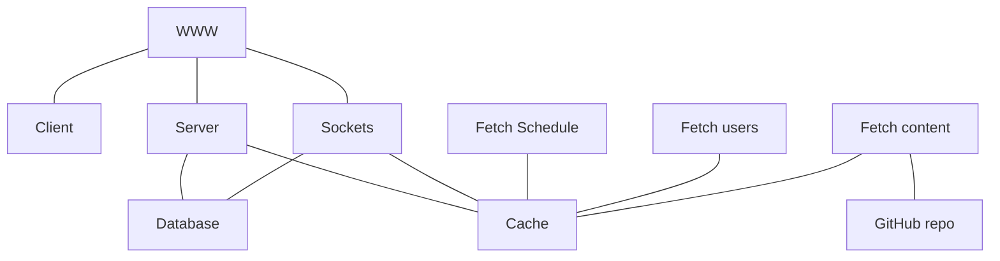

# Architecture

This document describes the high-level architecture of this MozFest plaza deployment.
If you want to familiarize yourself with the code or learn how everything works, you're in the right place!

## Components

There are several components that the system is broken into:

- [client](#client) — Vue.js Single Page App (SPA)
- [server](#server) — Node.js server
- [sockets](#sockets) — Socket.io server
- [jobs](#jobs) — Node.js scripts to be run periodically
- [content](#content) — Localised copy and configuration
- [config](#config) — Kubernetes manifests to deploy instances of the Plaza
- [deconf-ui](#deconf-ui) — the OSS project the UI uses to display schedules, sessions and etc
- [deconf-api](#deconf-api) — the OSS project the API uses to process data and serve authenticated information to clients
- [deconf-shared](#deconf-shared) — an OSS project between the ui & api varients to share code and types
- [cache](#cache) — Redis server for key-value paris and message brokering
- [database](#database) — Postgres database to store relational information

Here's a rough structure of the deployed components.
This architecture is designed to have as much content in the cache to be served really fast.
Then each of the public facing components (**server**, **client** & **sockets**) scale horizontally to meet demand.

> copy and past into [mermaid.live](https://mermaid.live) if you can't see a preview

### Client

The client, [./client](./client), is a Vue.js 2 web app that uses [deconf-ui](#deconf-ui) and adds custom logic.
A lot of the code is importing Deconf components, configuring them for the Plaza and serving them under [vue-router](https://router.vuejs.org) routes.

Cusom code for each iteration of the plaza has existed in this repo and has been contributed back to Deconf and reimplemented using the OSS version.

### Server

The server, [./server](./server), is a Node.js backend that uses [deconf-api](#deconf-api) and adds custom logic.
Lots of the endpoints serve things from the **cache** to be as fast as possible, other endpoints may touch the database to modify state or provide something custom.

Cusom code for each iteration of the plaza has existed in this repo and has been contributed back to Deconf and reimplemented using the OSS version.

There are also some webhooks to better integration with external services:

- tito — when a user registers, this records the registration locally and sends them a magic link to login straight away.

For deployment, the server is split into this **server** and **sockets** to allow each to scale seperately.
This is done through reverse-proxying to multiple deployments of the same container with different configurations.

### Sockets

Technically part of the **server**, but split out here because they are deployed seperately.
The sockets provide live interactions on the plaza using [socket.io](https://socket.io) that is replicated using the **cache**.

The main example of the live interactions is the "live visitors" widget on the Plaza homepage,
sockets has been used for other liveness including live interpretation of events.

The sockets are also used for in-Plaza metrics to collect information on how the Plaza is used.

### Jobs

Jobs are scripts within the server to perform specific jobs on a regular basis.
They are run via a CLI that is designed to be deployed as Kubernetes CronJob resources.
This measn the same **server** image can be used to run any of the jobs.

> They may use a **cache**-based semaphore to prevent concurrency.

#### fetch-schedule

The fetch-schedule job queries the Pretalx API for the latest information, formats it ready to be served by the **server** and puts it into the **cache** for quick access.
This job runs all-in-one so all information is pulled down that is needed, it is parsed and formatted into deconf structures and it completely replaces whatever was in **cache**.

#### fetch-users

The fetch-users job queries the TiTo API for registrations since the last scrape.
If there wasn't a "last scrape" it queries for all registrtaions.
If new registrations are found, it merges them into the existing copy in the **cache**.
Once the registration is in the **cache**, the user can log in to the Plaza.

#### fetch-content

The fetch-content job clones the **content** repository (originally it was a different git repository)
parses out the configuration and copy and puts them into the **cache**.

### Content

The [./content](./content) contains configuration for the plaza and localised copy for the client.
The [fetch-content](#fetch-content) job gets these static files into the **cache** to be served by the **server** and rendered by the **client**.

The use of this structure is to allow flexibility in the content and copy on the site.
This means that a new version of the app doesn't have to be released to change and update the copy or configuration of the site
and the copy and configuration can easily be changed through the GitHub web interface.

#### configuration

The `settings.json` config is used throughout the client:

- to determine which pages are turned on or visible
- to configure the widgets on the atrium
- to toggle navigation features in the main navigation bar
- to set the main video on the Plaza homepage

#### copy

Copy is localised markdown files in folders. For example `atrium/en.md` and `atrium/es.md` are the `atrium` copy with two localisations, English and Spanish.
There is then an endpoint in the **server** to request the copy for `atrium`.

### Config

The [mozfest-config](https://github.com/digitalinteraction/mozfest-config) defines how to deploy entire instances of the plaza using an infrastructure-as-code approach.
More info in [Deployment](#deployment).

### Deconf

Deconf is a collection of libraries for running virtual conferences, broken up into the domain they run in (i.e. frontend vs backend).

- [Deconf homepage →](https://github.com/digitalinteraction/deconf)

#### deconf-ui

The frontend library of deconf provides vue.js components and logic to do most of what the Plaza does in-browser.
It's designed to be customisable but it could be better.

The library provides the UI components and base styles for most of the Plaza,
exposed in a way that allows them to be customized by library consumers.

- [Deconf UI →](https://github.com/digitalinteraction/deconf-ui)
- [UI library →](https://deconf.openlab.dev/)

#### deconf-api

The backend library of deconf provides logic to process information and interact with the **database** or **cache**.
It's also the logic for most **jobs**.

- [Deconf API →](https://github.com/digitalinteraction/deconf-api)
- [API Doc →](https://deconf-api.openlab.dev/)

#### deconf-shared

This bit of deconf is for sharing code and TypeScript types between the front- and backend libraries

### Cache

The cache is a Redis database to store information for quick retrieval by the **server**.
It is designed to work as much as possible without it but things will be broken if certain keys haven't been set yet.

The cache is also used for semaphores in some occasions to prevent concurrency when it is needed.
e.g. when database migrations are happening or for certain jobs.

The cache is also used with by the **sockets** to allow it to scale horizontally.
Messages are broadcasted across the server and key-values are stored to allow this.

### Database

The database is a Postgres database to store things that persist, like users or which sessions they've added to their schedule.
The database uses migrations to setup the schema which are run automatically when a container starts up.
You can find the base [migrations here](https://github.com/digitalinteraction/deconf-api-toolkit/blob/main/src/database/migrations.ts).

## Upstream changes

The idea is that features for deconf are developed in the deployments that use the libraries then they are contributed back to the OSS project in the most configurable way possible.
The OSS project should be for _any_ conference and not include deployment (MozFest) specific things.

## Versioning & Release

The **client** and **server** share a version number and their containers are built at the same time.
The repository as a whole uses the top-level `package.json` as the version. When a new version is pushed to GitHub, it automatically builds the containers and pushes them to the container registry, `ghcr.io`.

The next version is automatically determined by the commits that have happened since the last version.
To do this, commits follow [conventional commits](https://www.conventionalcommits.org/en/v1.0.0/).
This is set up with [standard-version](https://www.npmjs.com/package/standard-version)
and [commitlint](https://commitlint.js.org/#/) to ensure the commit messages are correct and to run the release.

## Deployment

The deployment of different instances of the plaza are defined as Kubernetes manifests using Kustomize.
All of the configuration is in the [mozfest-config](https://github.com/digitalinteraction/mozfest-config) repository.

Once a new version is released, it can be deployed to an instance by modifying it's `images` section in the `kustomization.yml` then applying the configuration to Kubernetes.

There has been automatic deployments of these manifests to the cluster but it ended up slowing rapid changes down. For now, these manifests should be the source of truth to deploy from.

### Kubernetes resources

In the config repository, there is the `base` folder which is what each instance starts with.
It contains a blank-ish set of Kubernetes manifests to deploy the instance:

- A Deployment+Service resource for the **client**
- A Deployment+Service resource for the **server**
- A Deployment+Service resource for the **cache** (sometimes a managed redis server has been used)
- A Deployment+Service resource for "sockets", a **server** container but only exposing the the socket.io stuff
- CronJob resources for the jobs
- A ConfigMap with the DigitalOcean root certificate authority needed to connect to a DO database

Overlays are used to create instances from the "base" configuration. They customise the resources above and add new resources too.
This means there can be a production, development or staging instance within the same Kubernetes cluster.

**production**

- Specific ConfigMaps are created to configure the containers to be production
- ExternalSecrets are added to mount in secrets from an external secret store, more info in [dependencies](#cluster-dependencies).
- HorizontalPodAutoscalers are used to automatically scale the number of pods serving the **client**, **server** or **sockets**.
- There are some http redirects served by a plain [nginx](https://nginx.org/en/) container
- The schedule of the jobs may be configured to change the frequency around key events or times.
- Ingress resources are added to expose the containers to the world wide web.
- The version of container images to use is set in the `kustomization.yml`

**other instances**

There have been other ephemeral instances, e.g. to test features, which use the same approach as production with different images and probably without the HPA resources.

### Cluster dependencies

The resources above depend of a few things in the cluster.

For Ingress resources, there needs to be an IngressController in the cluster, [ingress-nginx](https://kubernetes.github.io/ingress-nginx/) has been used with success so far.

For secret management, [ExternalSecrets](https://external-secrets.io/latest/) needs to be installed into the cluster and configured to talk to the secrets provider being referenced.
This means all configuration for instances can be defined in the.

[Cert Manager](https://cert-manager.io) is expected to be installed and if so it will automatically create Let's Encrypt certificates to satisfy the Ingress resources.

HorizontalPodAutoscalers only work if there is something to provide metrics to the Kubernetes scheduler, we use [metrics-server](https://github.com/kubernetes-sigs/metrics-server) to provide them.
