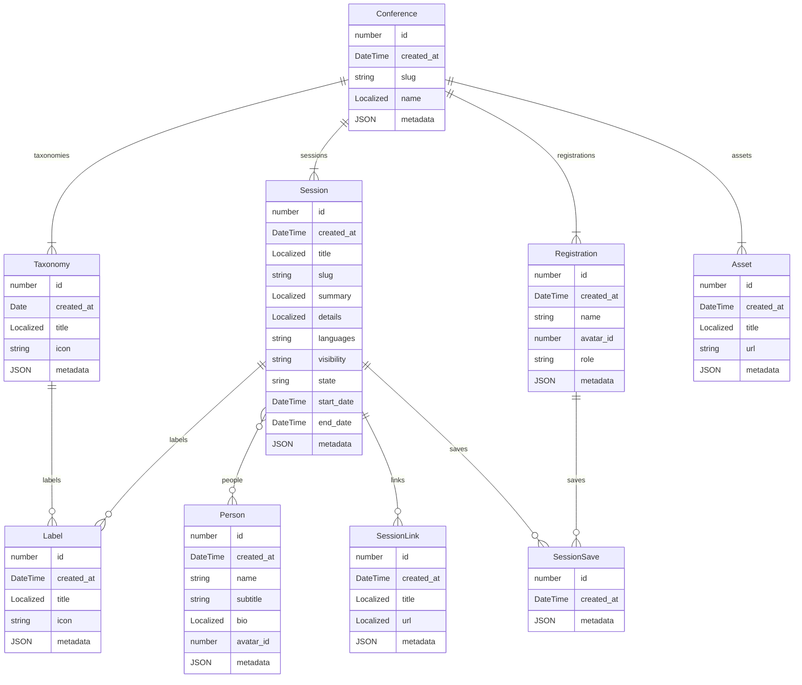

# Moz Data

If you don’t mind simple TypeScript, [types.ts](https://github.com/digitalinteraction/deconf/blob/api-server/api-server/source/lib/types.ts) might be helpful

## Data types

These are some of the database models that the MozFest schedule uses:

## General fields

- Any `id` field is unique to the MozFest database
- Any `created_at` timestamp is when the record was first imported
- The `metadata` field is a JSON blob that contains losely structure meta information,
  they usually contain a `ref` field which is a reference to where the record was imported from
  - e.g. `ref = pretalx/type/1234`
  - e.g. `ref = tito/email/[sha1 hash of the email]`

## Meta layer

With the Taxonomy / Label relationship, custom organisation systems can be deployed for different conferences.
A Taxonomy can be any classification to organise things by, like a Category, Theme or Tag.
Labels are the allowed values within a Taxonomy, e.g. a specific theme like AI or Agriculture or a session format like Debate or Keynote.
Sessions are then related to these labels.

## Pretalx integration

Records pulled from pretalx will have their `metadata.ref` set based on the type of record it came from,
so that they can be updated in the future to provide consistency. e.g. `pretalx/submission/3389FV` or `pretalx/type/5838`

**Sessions** come from [Pretalx submissions](https://pretalx.com/orga/event/mozilla-festival-2025/submissions/)

- `title`, `summary` & `details` are pulled through
- `slug` is the pretalx code
- `state` is a simplified pretalx state ~ confirmed, draft or accepted
- `start_date` and `end_date` come from the pretalx slot, when the session is scheduled
- `visibility` is set to public when the "Public" tag is applied, otherwise it is private

**SessionLinks** come from resources attached to submissions

- `title`, `url` are pulled through

**People** come from [Pretalx speakers](https://pretalx.com/orga/event/mozilla-festival-2025/speakers/), when there are on a confirmed/accepted submission

- `name` & `bio` are pulled through

There are three **Taxonomy** records and their labels are generated based on different pretalx information

- Tracks - labels are generated from [pretalx rooms](https://pretalx.com/orga/event/mozilla-festival-2025/schedule/rooms/)
- Themes - labels are generated from [pretalx tracks](https://pretalx.com/orga/event/mozilla-festival-2025/cfp/tracks/)
- Types - labels are generated from [pretalx types](https://pretalx.com/orga/event/mozilla-festival-2025/cfp/types/)

## TiTo integration

Records pulled from TiTo will have a `metadata.ref` set to a hash of the unique email they are based on, i.e. `tito/email:<sha1 hash of email>`

**Users** are generated from TiTo tickets, one per unique email (duplicate emails are ignored)

- `email` & `consented_at` are pulled through

**Registrations** also come from TiTo tickets, there is one for each user

- `name` is pulled through
- `role` is set to "attendee"

## Schedule data

**SessionSaves** are created when a user adds a session to their "MySchedule",
this links a registration to a session. That can then be linked to a user through the registration
and to labels, taxonomies and people through the session.
